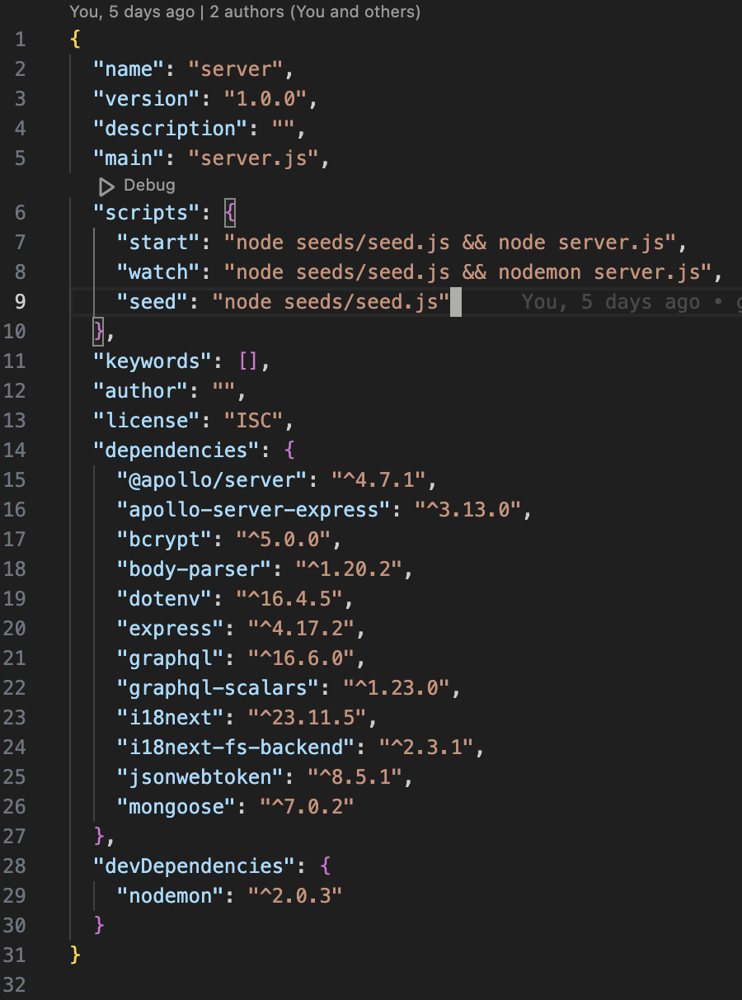
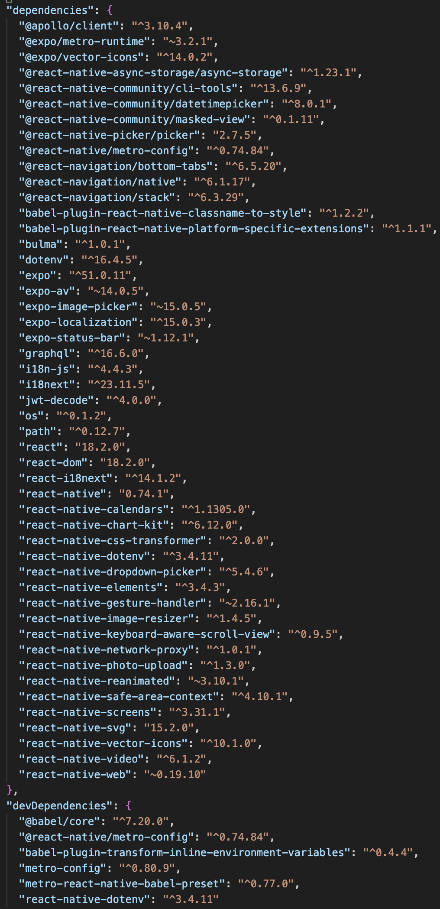

<a name="readme-top"></a>

[![Contributors][contributors-shield]][contributors-url]
[![Forks][forks-shield]][forks-url]
[![Stargazers][stars-shield]][stars-url]
[![Issues][issues-shield]][issues-url]
[![MIT License][license-shield]][license-url]
<!-- [![LinkedIn][linkedin-shield]][linkedin-url] -->
</br>

<br />
<div align="center">
  <a href="https://github.com/beckpull/fitFusion">

<h1 align="center">FitFusion</h1>

  <p align="center">
A sophisticated fitness tracking application powered by React Native, MongoDB, GraphQL, Apollo Client and Server, Express, and JWT tokens, meticulously crafted to empower users to create personalized workout plans, set goals, and track their fitness journey seamlessly.
    <br />
    <a href="https://github.com/beckpull/fitFusion"><strong>Explore the docs »</strong></a>
    <br />
    <br />
    <a href="https://www.github.com/beckpull/fitFusion">View Repository</a>
    ·
    <a href="https://github.com/beckpull/fitFusion/issues">Report Bug</a>
    ·
    <a href="https://github.com/beckpull/fitFusion/issues">Request Feature</a>
  </p>
</div>

</br>
</br>

<!-- TABLE OF CONTENTS -->
<details>
  <summary>Table of Contents</summary>
  <ol>
    <li>
      <a href="#about-the-project">About The Project</a>
      <ul>
        <li><a href="#built-with">Built With</a></li>
      </ul>
    </li>
    <li>
      <a href="#getting-started">Getting Started</a>
      <ul>
        <li><a href="#prerequisites">Prerequisites</a></li>
        <li><a href="#installation">Installation</a></li>
      </ul>
    </li>
    <li><a href="#usage">Usage</a></li>
    <li><a href="#roadmap">Roadmap</a></li>
    <li><a href="#contributing">Contributing</a></li>
    <li><a href="#license">License</a></li>
    <li><a href="#contact">Contact</a></li>
     <li><a href="#acknowledgments">Acknowledgments</a></li>
  </ol>
</details>

</br>
</br>

<!-- ABOUT THE PROJECT -->

## About The Project

The FitFusion project is a collaborative effort among five passionate individuals from Denver University who share a common goal of creating a comprehensive fitness tracking application. Named FitFusion, this app aims to revolutionize the way users approach their fitness routines by providing a seamless and personalized experience.

### Overview:

FitFusion is designed to be an all-in-one solution for fitness enthusiasts, integrating cutting-edge technologies and innovative features to enhance the user experience. The app utilizes React Native for its frontend development, ensuring a responsive and intuitive interface across various devices and screen sizes.

At the heart of FitFusion lies its backend infrastructure, powered by MongoDB, GraphQL, Apollo Server, Express, and JWT tokens. This robust combination of technologies enables efficient data management, authentication, and seamless communication between the frontend and backend components of the application.

The core functionality of FitFusion revolves around empowering users to create and customize their workout plans. Leveraging the ExerciseDB API, users can access a vast library of exercises categorized by muscle group, equipment, and name. This integration allows users to curate personalized workout routines tailored to their fitness goals and preferences.

In addition to workout planning, FitFusion offers users the ability to set specific goals for their fitness journey. Whether it's increasing reps, sets, or weights for strength training exercises, or tracking duration and distance for cardio workouts, users can establish measurable objectives to monitor their progress over time.

<!-- Furthermore, FitFusion goes beyond traditional fitness tracking apps by offering users a holistic approach to wellness. The platform features a dedicated "MyProfile" page where users can upload profile pictures and access comprehensive statistics on their fitness journey. This personalized dashboard provides insights into workout history, progress metrics, and achievement milestones, empowering users to stay motivated and focused on their fitness goals. -->

With a user-friendly interface, robust backend infrastructure, and innovative features, FitFusion aims to revolutionize the way users engage with their fitness routines. Whether users are beginners looking to kickstart their fitness journey or seasoned athletes seeking to optimize their training regimen, FitFusion provides the tools and resources needed to achieve success and lead a healthier, happier lifestyle.

### Key Features:

- **User Authentication**: Users can sign up or log in securely using JWT tokens.
- **Workout Plan** Creation: Users can create custom workout plans using ExerciseDB API exercises.
- **Goal Setting**: Users can set goals for their workout routines, including reps, sets, weight, duration, or distance and track their progress on over time.
- **MyProfile Page**: Users have a dedicated profile page where they can upload a profile picture.
 <!-- and view their fitness journey statistics. -->
- **Nutritional Blog**: The app includes a blog page with nutritional blog posts about healthy lifestyle and dietary tips.
- **About Us Page**: Features user testimonials and an introduction to the development team.
- **Data Visualization**: Graphs or data visualizations to show user progress on exercises over time, possibly using the D3 library.
- **Language Translations**: Implementation of language translations in English, Spanish, and Portuguese initially, expanding to other languages.


### Technologies Used:

- **Frontend**: React Native, Apollo Client, GraphQL
- **Backend**: MongoDB, Mongoose, Apollo Server, GraphQL, Node.js, Express
- **Authentication**: JWT tokens, jwt-decode, custom authentication middleware
- **External APIs**: ExerciseDB API, external motivational message API
- **Data Visualization**: D3 library (potentially)
- **Deployment**: 

### Goals:

The primary objective of the FitFusion project is to develop a comprehensive fitness tracking application that provides users with a seamless and personalized experience. By integrating various technologies and features, including GraphQL, MongoDB, Apollo Client and Server, and JWT authentication, the team aims to create a scalable and efficient platform for users to track their fitness progress. Additionally, future developments such as enhanced profile pages, user-generated content, social features, and accessibility options will further enhance the user experience and engagement with the app.

<p align="right">(<a href="#readme-top">back to top</a>)</p>

### Built With

- 
- 
- 
- 
- 
<!-- -  -->
- ![NodeJS]
- 
- 
- 
- 
<!-- -  -->
- 
- 
- 
- 
- 
<!-- -  -->

<p align="right">(<a href="#readme-top">back to top</a>)</p>

<!-- GETTING STARTED -->

## Getting Started

### Prerequisites

_This application has several dependencies, to install individually onto your machine, navigate to the directory this code lives in and type these npm i `<dependency>` into your Terminal / Git Bash:_




### Installation

_To get a local copy up and running follow these simple example steps:_

1. Clone the repo
   ```sh
   HTTP: git clone https://github.com/beckpull/fitFusion.git
   SSH: git clone git@github.com:beckpull/fitFusion.git
   ```
2. Install all necessary NPM packages
   ```sh
   npm i && npm run build
   ```
3. Run in two [split] terminals `cd server && npm run watch` & `cd client && npm run start`

<p align="right">(<a href="#readme-top">back to top</a>)</p>

<!-- USAGE EXAMPLES -->

## Usage
</br></br>
<p align="center"><i><strong>✨ Everything you need to know ✨</strong></i></p>

<div align="center"> 
  <!-- 
  </br>
  <strong><i>Scan the QR code above or click <strong><a href="">HERE</a></strong> to view this deployed app!</strong> -->
    <a href="https">
    <p>Placeholder</p>
      
      
    </a>
    </br></br>
    <a href="">
      <p>Placeholder</p>
      
      
    </a>
    <a href="">
      <p>Placeholder</p>
      
      
    </a>
    <a href="">
      <p>Placeholder</p>
      
      
    </a>
    <a href="">
      <p>Placeholder</p>
      
      
    </a>
    <a href="">
      <p>Placeholder</p>
      
      
    </a>
</br>
</div>

<p align="right">(<a href="#readme-top">back to top</a>)</p>

<!-- ROADMAP -->

<!-- ## Roadmap


<div align="right">
  <p><i>This was our roadmap for this project</i></p>
</div>
</br>


<p align="right">(<a href="#readme-top">back to top</a>)</p> -->

<!-- CONTRIBUTING -->
## Future Developments:

- **Finalize app preparation and deploy to Google Play and Apple App Store.**
- **Implement the forgot password functionality using Nodemailer and secure token verification.**
- **Stripe functionality**: Integrate Stripe for payment processing and handle subscriptions or premium features.
- **Accessibility Considerations**: Implement filters/functionality for users with physical restrictions or disabilities.
- **Social Features**: Users can friend other users, view their progress, and work out together. Develop and integrate friend management and progress sharing functionalities.
- **Real-time Workout Tracking**: Implementation of a real-time workout tracking feature.
- **Body Modal**: Users can visually select body parts for workouts, with pop-up messages providing information about selected muscle groups and then filter workout results by target and secondary muscles based on user selection.
- **Motivational Messages**: Display motivational messages and tips from an external API (Quotes API?). Integrate gym tips and tricks either from an API or a custom service.
- **Light and Dark Theme**: Addition of light and dark theme options for user preference.
- **User-Generated Blog Posts**: Users can contribute to the blog, creating a live feed of user-generated content.


## Contributing

Contributions are what make the open source community such an amazing place to learn, inspire, and create. Any contributions you make are **greatly appreciated**!

_If you have a suggestion that would make this better, please fork the repo and create a pull request. You can also simply open an issue with the tag "enhancement".
Don't forget to give the project a star! Thanks again!_

1. Fork the Project
2. Create your Feature Branch (`git checkout -b feature/NewFeature`)
3. Commit your Changes (`git commit -m 'Added ______ , NewFeature'`)
4. Push to the Branch (`git push origin feature/NewFeature`)
5. Open a Pull Request

See the [open issues](https://github.com/beckpull/fitFusion/issues) for a full list of proposed features (and known issues).

<p align="right">(<a href="#readme-top">back to top</a>)</p>

<!-- LICENSE -->

## License

<p align='center'>Distributed under the MIT License. See `LICENSE.txt` for more information.</p>
<p align='center'>© Beck Feltman · All rights reserved.</p>

<p align="right">(<a href="#readme-top">back to top</a>)</p>

<!-- CONTACT -->

## Contact

- **Silvia Reyes** - [Email her](mailto:snrvdevelopment@gmail.com) - or check her out on [GitHub](https://github.com/NathaliaReyes) or [LinkedIn!](https://www.linkedin.com/in/silviareyes23/)
- **Jordan Heersink** - [Email him](mailto:jheersink8@gmail.com) - or check him out on [GitHub](https://github.com/jheersink8) or [LinkedIn!](https://www.linkedin.com/in/jordan-heersink/)
- **William Kalish** - [Email him](mailto:williamk31@gmail.com) - or check him out on [GitHub](https://github.com/williamk31) or [LinkedIn!](https://www.linkedin.com/in/william-kalish/)
- **Zach Cook** - [Email him](mailto:zjclaw@gmail.com) - or check him out on [GitHub](https://github.com/ZachCook23) or [LinkedIn!](https://www.linkedin.com/in/zacharyjcookjd/)
- **Rebecca Feltman** - [Email me](mailto:beckpull@icloud.com) - or check me out on [GitHub](https://github.com/beckpull) or [LinkedIn!](https://www.linkedin.com/in/beckpull)

> Repository Link: [https://github.com/beckpull/fitFusion](https://github.com/beckpull/fitFusion)

<p align="right">(<a href="#readme-top">back to top</a>)</p>

<!-- ACKNOWLEDGMENTS -->

## Acknowledgments

- This README file template was created by [@othneildrew](https://github.com/othneildrew) - the original can be found [here](https://github.com/othneildrew/Best-README-Template)

#### Disclaimer:

> We utilized several articles from sources such as (but not limited to) Stack Overflow, W3Schools, and MDN Web Docs, as well as many classwork example code from the University of Denver **as references** for the javascript code attached.
>
> **All of the utilized information has been altered in order to fit this project. This repository contains _solely_ our own work.**

<p align="right">(<a href="#readme-top">back to top</a>)</p>

<!-- MARKDOWN LINKS & IMAGES -->
<!-- https://www.markdownguide.org/basic-syntax/#reference-style-links -->

[contributors-shield]: https://img.shields.io/github/contributors/beckpull/fitFusion.svg?style=for-the-badge
[contributors-url]: https://github.com/beckpull/fitFusion/graphs/contributors
[forks-shield]: https://img.shields.io/github/forks/beckpull/fitFusion.svg?style=for-the-badge
[forks-url]: https://github.com/beckpull/fitFusion/network/members
[stars-shield]: https://img.shields.io/github/stars/beckpull/fitFusion.svg?style=for-the-badge
[stars-url]: https://github.com/beckpull/fitFusion/stargazers
[issues-shield]: https://img.shields.io/github/issues/beckpull/fitFusion.svg?style=for-the-badge
[issues-url]: https://github.com/beckpull/fitFusion/issues
[license-shield]: https://img.shields.io/github/license/beckpull/fitFusion.svg?style=for-the-badge
[license-url]: https://github.com/beckpull/fitFusion/blob/main/LICENSE
[NodeJS]: https://img.shields.io/badge/node.js-6DA55F?style=for-the-badge&logo=node.js&logoColor=white
[Node-url]: https://nodejs.org/en
[linkedin-shield]: https://img.shields.io/badge/linkedin-%230077B5.svg?style=for-the-badge&logo=linkedin&logoColor=white
[linkedin-url]: https://linkedin.com/in/beckpull/

